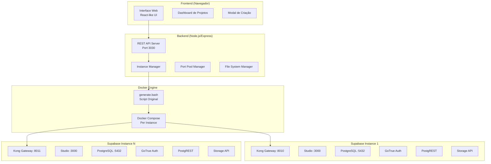
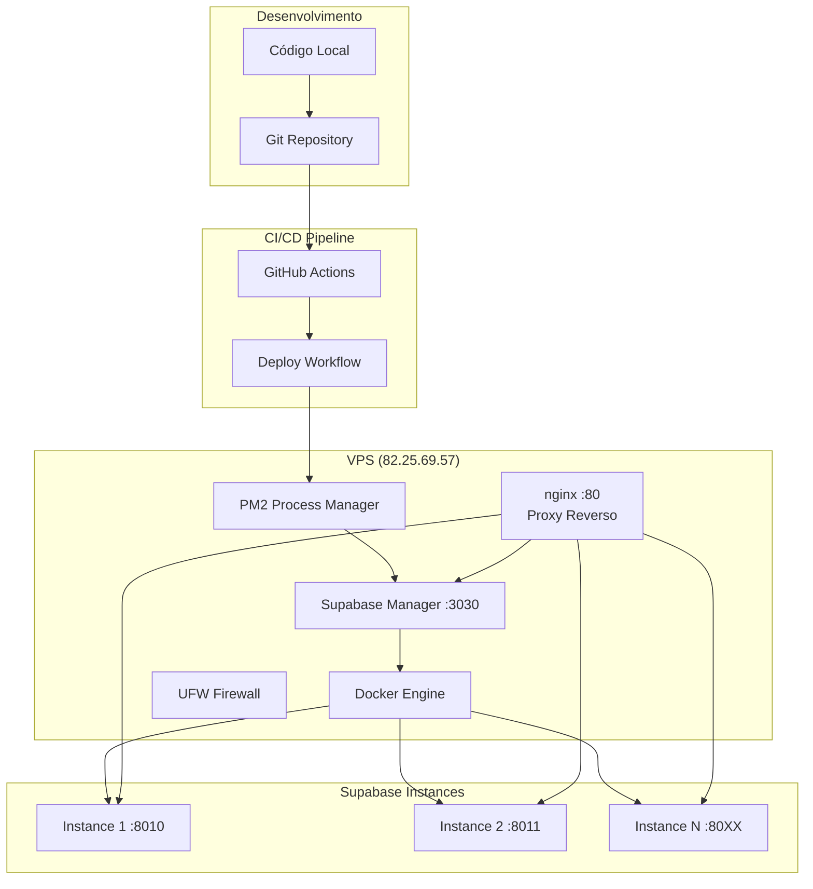

# 🏗️ Arquitetura do Supabase Manager

Documentação técnica completa sobre como a aplicação está implementada e como funciona o processo de criação de instâncias.

## 📋 Índice

- [Visão Geral](#-visão-geral)
- [Arquitetura do Sistema](#-arquitetura-do-sistema)
- [Componentes Principais](#-componentes-principais)
- [Fluxo de Criação de Instância](#-fluxo-de-criação-de-instância)
- [Isolamento e Segurança](#-isolamento-e-segurança)
- [Sistema de Portas](#-sistema-de-portas)
- [Estrutura de Arquivos](#-estrutura-de-arquivos)
- [API Endpoints](#-api-endpoints)
- [Deploy e Infraestrutura](#-deploy-e-infraestrutura)

## 🎯 Visão Geral

O **Supabase Manager** é um painel web que transforma o script manual `generate.bash` em uma interface visual para gerenciar múltiplas instâncias Supabase isoladas em uma única VPS.

### Conceito Principal
```
Script Manual (generate.bash) → Interface Web → Múltiplas Instâncias Isoladas
```

## 🏛️ Arquitetura do Sistema



## 🧩 Componentes Principais

### 1. **Frontend (Single Page Application)**
- **Localização**: `panel/public/index.html`
- **Tecnologia**: HTML5 + CSS3 + Vanilla JavaScript
- **Funcações**:
  - Dashboard com lista de projetos
  - Modal de criação de instâncias
  - Monitoramento de status em tempo real
  - Interface idêntica ao Supabase Cloud

```javascript
// Principais funções do frontend
loadInstances()     // Carrega lista de instâncias
createInstance()    // Cria nova instância
startInstance()     // Inicia instância parada
stopInstance()      // Para instância rodando
deleteInstance()    // Remove instância completamente
```

### 2. **Backend (Node.js/Express)**
- **Localização**: `panel/server.js`  
- **Port**: `3030`
- **Funcionalidades**:
  - API REST para gerenciamento de instâncias
  - Execução do script `generate.bash`
  - Pool de portas automático
  - Monitoramento de containers Docker

#### Pool de Portas Implementado:
```javascript
const PORT_RANGES = {
  kong_http: { start: 8010, end: 8099 },     // 90 instâncias
  kong_https: { start: 8410, end: 8499 },   // 90 instâncias  
  postgres_ext: { start: 5410, end: 5499 }, // 90 instâncias
  analytics: { start: 4010, end: 4099 }     // 90 instâncias
};
```

### 3. **Script Original (generate.bash)**
- **Localização**: `docker/generate.bash`
- **Status**: **NÃO MODIFICADO** - Mantido 100% original
- **Função**: Cria instância Supabase completa com Docker Compose

### 4. **Templates de Configuração**
- **docker-compose.yml**: Template para containers
- **.env.template**: Template para variáveis de ambiente  
- **kong.yml**: Template para configuração do gateway

## 🔄 Fluxo de Criação de Instância

### Passo a Passo Detalhado:

#### **1. Usuário Cria Projeto na Interface**
```javascript
// Frontend envia requisição
POST /api/instances
{
  "name": "Meu App"
}
```

#### **2. Backend Processa Requisição**
```javascript
// 1. Validação
- Nome único ✓
- Nome não vazio ✓

// 2. Geração de IDs e Portas
instanceId = Date.now().toString()          // Ex: "1643723400"
jwt_secret = crypto.randomBytes(32).toString('hex')

// 3. Alocação de Portas Únicas
ports = {
  kong_http: 8010,      // Primeira porta livre
  kong_https: 8410,     // Primeira porta livre  
  postgres_ext: 5410,   // Primeira porta livre
  analytics: 4010       // Primeira porta livre
}
```

#### **3. Execução do Script Original**
```bash
# Backend executa generate.bash com variáveis customizadas
spawn('bash', ['generate.bash'], {
  cwd: '/docker',
  env: {
    INSTANCE_ID: "1643723400",
    JWT_SECRET: "a1b2c3d4...",
    KONG_HTTP_PORT: "8010",
    KONG_HTTPS_PORT: "8410", 
    POSTGRES_PORT_EXT: "5410",
    ANALYTICS_PORT: "4010",
    API_EXTERNAL_URL: "http://82.25.69.57:8010",
    SUPABASE_PUBLIC_URL: "http://82.25.69.57:8010",
    STUDIO_DEFAULT_PROJECT: "Meu App"
  }
})
```

#### **4. Script Gera Arquivos da Instância**
```bash
# generate.bash cria:
.env-1643723400                    # Variáveis específicas
docker-compose-1643723400.yml     # Compose da instância
volumes-1643723400/               # Dados isolados
├── api/kong.yml                  # Config Kong
├── db/                          # Scripts PostgreSQL  
├── functions/                   # Edge Functions
└── logs/vector.yml              # Config de logs
```

#### **5. Containers Supabase Iniciam**
```bash
# Script executa automaticamente:
docker compose -f docker-compose-1643723400.yml \
  --env-file .env-1643723400 up -d
```

#### **6. Instância Fica Disponível**
```javascript
// Resultado final:
{
  "id": "1643723400",
  "name": "Meu App", 
  "status": "running",
  "ports": {
    "kong_http": 8010,
    "kong_https": 8410,
    "postgres_ext": 5410,
    "analytics": 4010
  },
  "urls": {
    "studio": "http://82.25.69.57:8010",
    "api": "http://82.25.69.57:8010"
  }
}
```

## 🔒 Isolamento e Segurança

### 1. **Isolamento por Container**
Cada instância possui containers completamente separados:

```yaml
# docker-compose-{INSTANCE_ID}.yml
services:
  studio:
    container_name: supabase-studio-${INSTANCE_ID}
    # Dados isolados por INSTANCE_ID
    
  kong:
    container_name: supabase-kong-${INSTANCE_ID}
    # Portas únicas por instância
    
  db:
    container_name: supabase-db-${INSTANCE_ID}
    # Volume isolado
```

### 2. **Isolamento de Dados**
```bash
# Volumes separados por instância
volumes-1643723400/    # Instância 1
├── db/data/          # PostgreSQL isolado
├── storage/          # Arquivos isolados
└── functions/        # Edge Functions isoladas

volumes-1643723401/    # Instância 2
├── db/data/          # PostgreSQL isolado
├── storage/          # Arquivos isolados  
└── functions/        # Edge Functions isoladas
```

### 3. **Isolamento de Autenticação**
```javascript
// Cada instância tem JWT único
instance1.jwt_secret = "a1b2c3d4e5f6..."  // JWT exclusivo
instance2.jwt_secret = "f6e5d4c3b2a1..."  // JWT exclusivo

// ANON_KEY e SERVICE_ROLE_KEY são geradas com base no JWT
```

### 4. **Isolamento de Rede**
```bash
# Portas exclusivas por instância
Instance 1: Kong HTTP :8010, HTTPS :8410, DB :5410, Analytics :4010
Instance 2: Kong HTTP :8011, HTTPS :8411, DB :5411, Analytics :4011
Instance 3: Kong HTTP :8012, HTTPS :8412, DB :5412, Analytics :4012
```

## 🌐 Sistema de Portas

### Distribuição de Portas por Serviço:

| Serviço | Range | Quantidade | Exemplo |
|---------|-------|-----------|---------|
| **Kong HTTP** | 8010-8099 | 90 instâncias | 8010, 8011, 8012... |
| **Kong HTTPS** | 8410-8499 | 90 instâncias | 8410, 8411, 8412... |
| **PostgreSQL Ext** | 5410-5499 | 90 instâncias | 5410, 5411, 5412... |
| **Analytics** | 4010-4099 | 90 instâncias | 4010, 4011, 4012... |

### Algoritmo de Alocação:
```javascript
function getAvailablePort(range, usedPorts) {
  for (let port = range.start; port <= range.end; port++) {
    if (!usedPorts.includes(port)) {
      return port;  // Primeira porta livre
    }
  }
  throw new Error(`Nenhuma porta disponível no range ${range.start}-${range.end}`);
}
```

## 📁 Estrutura de Arquivos

### Estrutura Completa do Projeto:
```
ultrabaseultra/
├── panel/                          # 🎛️ Painel Web
│   ├── server.js                   # Backend API
│   ├── package.json                # Dependências Node.js
│   ├── public/index.html           # Frontend SPA
│   ├── data/instances.json         # Banco de dados JSON
│   └── README.md                   # Documentação do painel
│
├── docker/                         # 🐳 Scripts Supabase  
│   ├── generate.bash               # Script original (não modificado)
│   ├── docker-compose.yml          # Template de containers
│   ├── .env.template               # Template de variáveis
│   └── volumes/                    # Arquivos base
│       ├── api/kong.yml            # Config Kong template
│       ├── db/                     # Scripts PostgreSQL
│       ├── functions/              # Edge Functions base
│       └── logs/vector.yml         # Config de logs
│
├── scripts/                        # 🚀 Deploy e Automação
│   ├── deploy-manual.sh            # Deploy manual Linux/Mac
│   └── deploy-manual.bat           # Deploy manual Windows
│
├── .github/workflows/              # ⚙️ CI/CD
│   └── deploy.yml                  # GitHub Actions deploy
│
├── DEPLOY.md                       # 📋 Guia de deploy
├── ARCHITECTURE.md                 # 🏗️ Esta documentação
└── README.md                       # 📖 Documentação geral
```

### Estrutura Gerada por Instância:
```
docker/
├── .env-{INSTANCE_ID}              # Variáveis da instância
├── docker-compose-{INSTANCE_ID}.yml # Compose da instância
└── volumes-{INSTANCE_ID}/          # Dados isolados
    ├── api/kong.yml                # Kong configurado
    ├── db/                         # PostgreSQL
    │   ├── data/                   # Dados do banco
    │   ├── init/                   # Scripts de inicialização
    │   ├── jwt.sql                 # Configurações JWT
    │   ├── roles.sql               # Roles do banco
    │   └── webhooks.sql            # Webhooks
    ├── functions/                  # Edge Functions
    │   ├── hello/index.ts          # Função exemplo
    │   └── main/index.ts           # Função principal
    ├── logs/vector.yml             # Config de logs
    └── storage/                    # Arquivos (criado em runtime)
```

## 🔌 API Endpoints

### Especificação Completa da API:

#### **GET `/api/instances`**
Lista todas as instâncias com status atualizada.

**Response:**
```json
{
  "instances": [
    {
      "id": "1643723400",
      "name": "Meu App",
      "status": "running",
      "created_at": "2025-01-30T10:30:00.000Z",
      "jwt_secret": "a1b2c3d4e5f6...",
      "ports": {
        "kong_http": 8010,
        "kong_https": 8410,
        "postgres_ext": 5410,
        "analytics": 4010
      },
      "urls": {
        "studio": "http://82.25.69.57:8010",
        "api": "http://82.25.69.57:8010"
      }
    }
  ]
}
```

#### **POST `/api/instances`**
Cria nova instância Supabase.

**Request:**
```json
{
  "name": "Nome do Projeto"
}
```

**Response:**
```json
{
  "message": "Instância sendo criada...",
  "instance": {
    "id": "1643723400",
    "name": "Nome do Projeto",
    "status": "creating",
    "ports": { ... },
    "urls": { ... }
  }
}
```

#### **POST `/api/instances/{id}/start`**
Inicia uma instância parada.

**Response:**
```json
{
  "message": "Instância iniciada com sucesso"
}
```

#### **POST `/api/instances/{id}/stop`**
Para uma instância em execução.

**Response:**
```json
{
  "message": "Instância parada com sucesso"
}
```

#### **DELETE `/api/instances/{id}`**
Remove instância completamente (containers + volumes + arquivos).

**Response:**
```json
{
  "message": "Instância removida com sucesso"
}
```

## 🚀 Deploy e Infraestrutura

### Arquitetura de Deploy:



### Stack de Tecnologias:

#### **Frontend:**
- HTML5 + CSS3 + Vanilla JavaScript
- Design System idêntico ao Supabase Cloud
- Responsivo e otimizado

#### **Backend:**
- Node.js 18 + Express.js
- File System para persistência (JSON)
- Child Process para execução de scripts
- CORS habilitado

#### **Infraestrutura:**
- **VPS**: Ubuntu/Debian 
- **Proxy**: nginx (port 80 → 3030)
- **Process Manager**: PM2 com auto-restart
- **Containers**: Docker + Docker Compose
- **Firewall**: UFW com portas específicas
- **CI/CD**: GitHub Actions

#### **Segurança:**
- Firewall configurado automaticamente
- Containers isolados por instância
- JWT únicos por projeto
- nginx com headers de segurança
- Processo não-root quando possível

## 📊 Monitoramento e Logs

### Sistema de Logs:
```bash
# Logs do painel
/opt/supabase-manager/logs/combined.log
/opt/supabase-manager/logs/error.log
/opt/supabase-manager/logs/out.log

# Logs PM2
pm2 logs supabase-manager

# Logs nginx
journalctl -u nginx -f

# Logs Docker
docker logs supabase-studio-{INSTANCE_ID}
docker logs supabase-kong-{INSTANCE_ID}
```

### Monitoramento de Status:
```javascript
// Backend verifica status via Docker API
function checkContainerStatus(instanceId) {
  return new Promise((resolve) => {
    exec(`docker ps --filter "name=supabase-studio-${instanceId}"`, 
      (error, stdout) => {
        if (error || !stdout.trim()) {
          resolve('stopped');
        } else {
          resolve('running');
        }
      }
    );
  });
}
```

## 🎯 Considerações de Performance

### Limites e Capacidade:
- **Máximo de instâncias**: 90 (limitado por pool de portas)
- **RAM recomendada**: 8GB+ para múltiplas instâncias
- **CPU**: 4+ cores recomendado
- **Disco**: SSD recomendado (I/O intensivo)

### Otimizações Implementadas:
- Pool de portas eficiente
- Containers com resource limits
- nginx como proxy reverso
- PM2 com cluster mode disponível
- Logs com rotação automática

---

## 🔄 Fluxo Completo de Exemplo

Para ilustrar como tudo funciona junto, aqui está um exemplo completo:

### 1. **Usuário cria "Loja Online"**
- Interface: Clica "Novo projeto" → digita "Loja Online" → Criar

### 2. **Backend processa**
- Valida nome único ✓
- Gera ID: `1643723400`
- Aloca portas: Kong=8010, HTTPS=8410, DB=5410, Analytics=4010
- Cria JWT: `a1b2c3d4e5f6...`

### 3. **Script executa**
```bash
INSTANCE_ID=1643723400 \
JWT_SECRET=a1b2c3d4e5f6... \
KONG_HTTP_PORT=8010 \
./generate.bash
```

### 4. **Arquivos gerados**
- `.env-1643723400`
- `docker-compose-1643723400.yml`  
- `volumes-1643723400/`

### 5. **Containers sobem**
- `supabase-studio-1643723400`
- `supabase-kong-1643723400`
- `supabase-db-1643723400`
- etc.

### 6. **Instância disponível**
- Studio: `http://82.25.69.57:8010`
- API: `http://82.25.69.57:8010/rest/v1/`
- Auth: Kong admin/admin

### 7. **Dashboard atualiza**
- Status: 🟢 Online
- Botão "Abrir Studio" ativo
- Ações disponíveis

**E voila! Uma instância Supabase completa e isolada está rodando! 🎉**